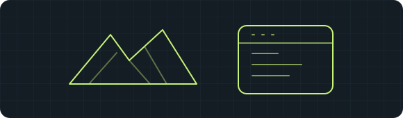
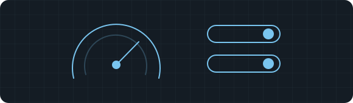
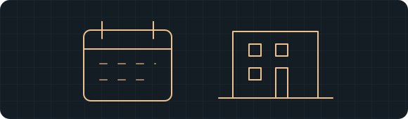

<picture>
  <source media="(max-width: 600px) and (prefers-color-scheme: dark)" srcset="./assets/hero-dark-mobile.svg">
  <source media="(max-width: 600px)" srcset="./assets/hero-light-mobile.svg">
  <source media="(prefers-color-scheme: dark)" srcset="./assets/hero-dark.svg">
  
</picture>

  <a href="mailto:ergyusuf34@gmail.com"><b>Email me ↗</b></a> &nbsp; · &nbsp;
  <a href="https://www.linkedin.com/in/yusuf-efe-ergino%C4%9Flu-b14512336/"><b>LinkedIn ↗</b></a> &nbsp; · &nbsp;
  <a href="https://github.com/yuefdev?tab=repositories"><b>Explore my code ↗</b></a> &nbsp; · &nbsp;
  <a href="./README.tr.md">Türkçe</a>

  
  
  

  

### I build the interface — and the systems behind it.

I'm **Yusuf**, a developer based in **Istanbul, Türkiye**, focused on **AI tooling, full-stack applications and desktop software**. I turn practical problems into connected products: the interface people use, the API behind it, and the automation that keeps it moving.

My background in **automation, e-commerce and technical service** shapes how I build: understand the workflow, make it easier to use, and pay attention to the details that matter after launch.

**Interested in:** AI application development · full-stack engineering · desktop products.

## Selected work

Four projects, with a different engineering problem behind each one.

<table>
<tr>
<td width="50%" valign="top">

<h3>01 / Riftroam</h3>

<b>A desktop companion for League of Legends.</b>

Connects the client experience with customization workflows and in-app updates. My work spans the desktop interface, Rust integration and release delivery.

<code>Tauri</code> <code>Svelte</code> <code>Rust</code>

<a href="https://github.com/yuefdev/riftroam-releases/releases"><b>Explore releases ↗</b></a> Public releases; application source is not published here.

</td>
<td width="50%" valign="top">

<h3>02 / DerdiniSeveyim</h3>

<b>A social support and matching application.</b>

A TypeScript monorepo bringing together an Expo mobile app, Next.js website and admin panel, and a NestJS API with authentication and real-time messaging.

<code>React Native</code> <code>Next.js</code> <code>NestJS</code> <code>PostgreSQL</code>

<a href="https://github.com/yuefdev/DerdiniSeveyim"><b>Explore the code ↗</b></a> · <a href="https://github.com/yuefdev/DerdiniSeveyim/tree/master/server">API</a> Public source for portfolio review.

</td>
</tr>
<tr>
<td width="50%" valign="top">

<h3>03 / Windows FPS Utility</h3>

<b>System settings, with less manual work.</b>

A portable WPF application that brings Windows power, visual-effect and gaming settings into one interface, with documented steps for reverting changes.

<code>C#</code> <code>.NET</code> <code>WPF</code>

<a href="https://github.com/yuefdev/unlostfpsarttirma"><b>Explore the code ↗</b></a> Repository: unlostfpsarttirma.

</td>
<td width="50%" valign="top">

<h3>04 / Harborlights</h3>

<b>From a static template to a working backend.</b>

An educational hospitality project: I extended an existing HTML template into an ASP.NET Core MVC application with reservations, content management and an admin panel.

<code>C#</code> <code>ASP.NET Core</code> <code>Entity Framework</code>

<a href="https://github.com/yuefdev/HarborRestaurant"><b>Explore the code ↗</b></a> Repository: HarborRestaurant.

</td>
</tr>
</table>

<b>Also exploring: AI developer tooling</b>

**[YuefIDE](https://github.com/yuefdev/yuefide)** is my AI development-environment project, focused on prompt building and code assistance. Its public repository currently contains the project overview.

## What I work with

| Area | Technologies I use |
| :--- | :--- |
| **Interfaces** | TypeScript, React, Next.js, Svelte, Tailwind CSS |
| **Mobile & desktop** | React Native / Expo, Tauri, Rust, C# / WPF |
| **APIs & data** | Node.js, NestJS, ASP.NET Core, PostgreSQL, Prisma, Redis |
| **AI & delivery** | Python, OpenAI API, LangChain, Docker, GitHub Actions |

I care about **clear interfaces, maintainable architecture and performance**. I like working across product boundaries: connecting a mobile screen to its API, a desktop action to its native integration, or a release to its update flow.

## GitHub, in context

<picture>
  <source media="(max-width: 600px) and (prefers-color-scheme: dark)" srcset="./assets/generated/github-dark-mobile.svg">
  <source media="(max-width: 600px)" srcset="./assets/generated/github-light-mobile.svg">
  <source media="(prefers-color-scheme: dark)" srcset="./assets/generated/github-dark.svg">
  
</picture>

Generated from public GitHub data; the collection date is shown in the chart. Contributions reflect the publicly visible calendar and the current month is partial. Language shares measure code bytes across owned public repositories, excluding forks — not proficiency or time spent.

Data sources and scope

The activity chart uses the [public GitHub calendar](https://github.com/yuefdev?tab=overview). It may include anonymized private contribution counts if profile settings expose them. The language chart uses the [GitHub repository languages API](https://docs.github.com/en/rest/repos/repos#list-repository-languages); libraries or generated files counted by GitHub can affect the result. Private application source is not represented in that chart.

[View the data](./assets/generated/github-data.json) · [Update workflow](./.github/workflows/profile-charts.yml)

## Let's build something useful.

For **engineering opportunities or project collaborations**, tell me what you're building and where I can help.

**[ergyusuf34@gmail.com](mailto:ergyusuf34@gmail.com)** · **[LinkedIn](https://www.linkedin.com/in/yusuf-efe-ergino%C4%9Flu-b14512336/)**

Yusuf Efe / <a href="https://github.com/yuefdev">@yuefdev</a>

