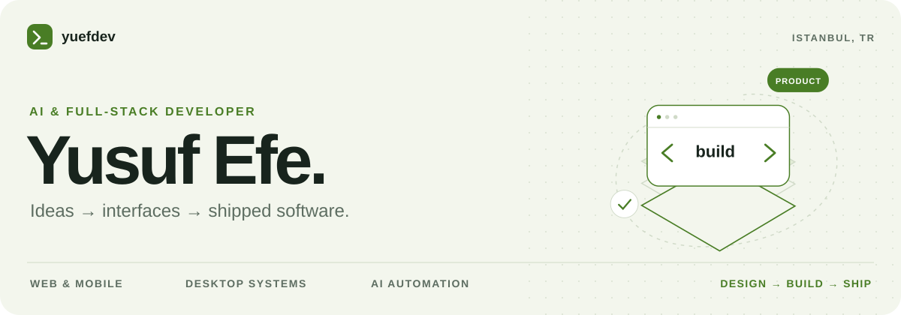
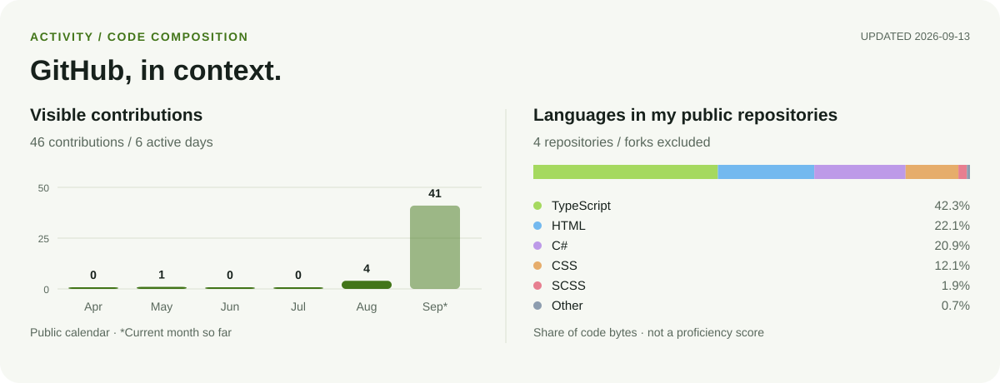

<picture>
  <source media="(max-width: 600px) and (prefers-color-scheme: dark)" srcset="./assets/hero-dark-mobile.svg">
  <source media="(max-width: 600px)" srcset="./assets/hero-light-mobile.svg">
  <source media="(prefers-color-scheme: dark)" srcset="./assets/hero-dark.svg">
  
</picture>

[English](./README.md) · [E-posta](mailto:ergyusuf34@gmail.com) · [LinkedIn](https://www.linkedin.com/in/yusuf-efe-ergino%C4%9Flu-b14512336/)

## Merhaba, ben Yusuf.

İstanbul'da yaşayan; **yapay zekâ araçları, web ve mobil uygulamalar, masaüstü yazılımları** geliştiren bir yazılımcıyım. Bir ürünün arayüzünü, arkasındaki API'yi ve günlük işlerini kolaylaştıran otomasyonları birlikte ele alıyorum.

**Otomasyon, e-ticaret ve teknik servis** geçmişim sayesinde önce gerçek ihtiyacı anlamaya, ardından kullanımı kolay bir çözüm üretmeye odaklanıyorum. Arayüz ayrıntıları, performans ve sürdürülebilir mimari benim için önemli.

**İlgilendiğim roller:** Yapay zekâ uygulama geliştirme, full-stack yazılım geliştirme ve masaüstü ürün geliştirme.

## Öne çıkan çalışmalarım

- **[Riftroam](https://github.com/yuefdev/riftroam-releases/releases)** — League of Legends için Tauri, Svelte ve Rust ile geliştirilen masaüstü yardımcı uygulaması. İstemci entegrasyonu, özelleştirme akışları ve uygulama içi güncelleme deneyimi üzerinde çalışıyorum. Bağlantı herkese açık sürüm deposuna gider; uygulamanın kaynak kodu bu depoda paylaşılmıyor.
- **[DerdiniSeveyim](https://github.com/yuefdev/DerdiniSeveyim)** — Expo/React Native mobil uygulaması, Next.js web sitesi ve yönetim paneli, NestJS API'si, kimlik doğrulama ve gerçek zamanlı mesajlaşmayı birleştiren TypeScript monoreposu.
- **[Windows FPS Utility](https://github.com/yuefdev/unlostfpsarttirma)** — Windows güç, görsel efekt ve oyun ayarlarını tek arayüzde toplayan C# / WPF uygulaması. Ayarları geri alma adımları belgelenmiştir.
- **[Harborlights](https://github.com/yuefdev/HarborRestaurant)** — Hazır bir HTML temasını ASP.NET Core MVC ile rezervasyon, içerik yönetimi ve yönetim paneli bulunan dinamik bir uygulamaya dönüştürdüğüm eğitim projesi.

**Yapay zekâ araçları:** [YuefIDE](https://github.com/yuefdev/yuefide), prompt oluşturma ve kod yardımı odaklı geliştirme ortamı projem. Herkese açık deposunda şu anda proje tanıtımı bulunuyor.

## Kullandığım teknolojiler

| Alan | Teknolojiler |
| :--- | :--- |
| Arayüz | TypeScript, React, Next.js, Svelte, Tailwind CSS |
| Mobil ve masaüstü | React Native / Expo, Tauri, Rust, C# / WPF |
| API ve veri | Node.js, NestJS, ASP.NET Core, PostgreSQL, Prisma, Redis |
| Yapay zekâ ve dağıtım | Python, OpenAI API, LangChain, Docker, GitHub Actions |

## GitHub grafikleri

<picture>
  <source media="(max-width: 600px) and (prefers-color-scheme: dark)" srcset="./assets/generated/github-dark-mobile.svg">
  <source media="(max-width: 600px)" srcset="./assets/generated/github-light-mobile.svg">
  <source media="(prefers-color-scheme: dark)" srcset="./assets/generated/github-dark.svg">
  
</picture>

Grafikler GitHub Actions ile günlük güncellenir. Katkılar profilin herkese açık takviminden alınır; içinde bulunulan ay henüz tamamlanmamıştır. Dil dağılımı, bana ait herkese açık depoların kod baytlarını gösterir; fork'lar dahil değildir. Yetenek puanı veya çalışma süresi ölçümü değildir.

## Birlikte çalışalım.

**İş fırsatları ve proje iş birlikleri** için geliştirdiğiniz ürünü ve hangi alanda katkı aradığınızı yazabilirsiniz.

**[ergyusuf34@gmail.com](mailto:ergyusuf34@gmail.com)** · **[LinkedIn](https://www.linkedin.com/in/yusuf-efe-ergino%C4%9Flu-b14512336/)**
